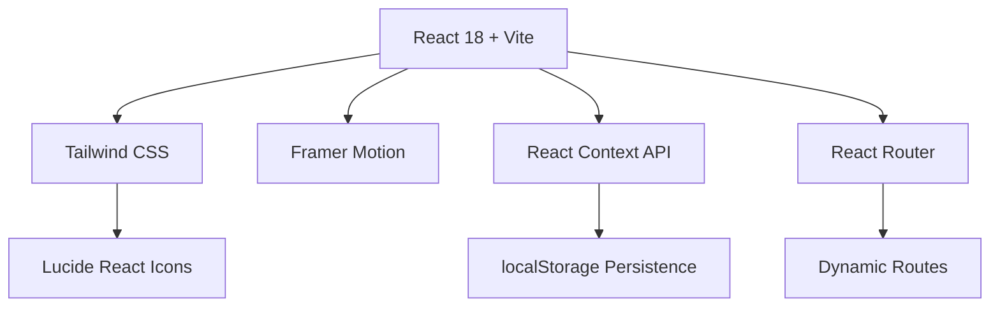

# SkillMirror 🪞

<div align="center">
  
</div>

**SkillMirror** is an AI-powered Student Performance Evaluator that bridges the gap between **perceived competence** and **actual technical skills**. With adaptive assessments, structured learning paths, and gamified progress tracking, it helps CS students identify blind spots and prepare for top-tier placements.

[**🚀 Live Demo**](https://skill-mirror-gray.vercel.app) | [**📱 Responsive Demo**](https://skill-mirror-gray.vercel.app) | [**📊 Analytics Dashboard**](#features)

---

## ✨ Features Overview

<div align="center">
  
| 🎯 **Assessment Engine** | 📚 **Learning Paths** | 🏆 **Gamification** |
|---|---|---|
| 6 domains (DSA, ML, Web Dev, DBMS, OS, Networks) | 7 structured paths (Python, JS, C++, Web Dev, SQL, Java, C Systems) | 20+ achievement badges |
| 10 progressive levels per domain (600+ questions) | 120+ modules with theory + code + quizzes | XP system & level progression |
| 80% pass threshold with detailed explanations | Interactive code playground | Daily streaks & leaderboards |
| Perception Gap Analysis | Hands-on coding challenges | Skill diagnostic reports |

</div>

---

## 🎨 Premium User Experience
🌌 Deep Space Dark Theme (#04050a) + Light Mode Toggle
✨ Glassmorphism Cards & Custom Cursor Animations
🎵 Ambient Music Player with Equalizer
⚡ Framer Motion Smooth Transitions
📱 Fully Responsive + Mobile-First Design

text

---

## 🛠️ Modern Tech Stack



| **Category** | **Technologies** |
|--------------|------------------|
| **Frontend** | React 18, Vite, React Router |
| **Styling** | Tailwind CSS, Glassmorphism |
| **Animations** | Framer Motion, CSS Custom Properties |
| **Icons** | Lucide React |
| **State** | Context API, localStorage |
| **Audio** | Web Audio API, Custom MP3 |
| **Email** | EmailJS Integration |

---

## 🚀 Getting Started

### Prerequisites
```bash
Node.js 16+ | npm/yarn | Code Editor (VS Code recommended)
```

### Quick Setup
```bash
# Clone & Install
git clone https://github.com/Jaanvichouhan34/SkillMirror.git
cd SkillMirror
npm install

# Development
npm run dev

# Production Build
npm run build
npm run preview
```

---

## 📱 Pages & Features
📍 Routes:
/home → Hero + Features + Testimonials
/assessment → Domain & Level Selection
/quiz → Adaptive 10-MCQ Assessment
/learn → 7 Learning Paths Dashboard
/profile → Skill Diagnostics + Progress
/contact → EmailJS Form Integration
/help → FAQ Knowledge Base

text

---

## 🏆 Achievement System

| **Badge** | **Requirement** | **XP Bonus** |
|-----------|-----------------|--------------|
| 🌱 Curious Mind | Complete 10 lessons | +100 XP |
| 🐍 Python Master | Finish Python path | +500 XP |
| 🎯 DSA Champion | Complete all DSA levels | +1000 XP |
| 🔥 On Fire | 7-day streak | +250 XP |
| 👑 Elite Coder | Reach 5000 XP | +2000 XP |

---

## 📈 SkillMirror in Action

<div align="center">
  
  <br><br>
  
</div>

---

## 🎯 Perfect For

- **Students**: Placement preparation with real skill diagnostics
- **Educators**: Track student progress across 6 domains
- **Developers**: Showcase modern React + Tailwind portfolio project
- **Teams**: Internal skill assessment & training platform


---

## 📊 Resume Highlights
✅ 600+ Unique Assessment Questions
✅ 120+ Learning Modules
✅ Full Gamification System (XP, Badges, Streaks)
✅ Glassmorphism UI with Custom Animations
✅ Theme Toggle (Dark/Light/System)
✅ Mobile-First Responsive Design
✅ EmailJS Contact Integration
✅ localStorage Persistence

text

---

## 🤝 Contributing

1. Fork the repository
2. Create your feature branch (`git checkout -b feature/AmazingFeature`)
3. Commit changes (`git commit -m 'Add some AmazingFeature'`)
4. Push to branch (`git push origin feature/AmazingFeature`)
5. Open Pull Request

---

## 👤 About the Creator

<div align="center">

**Jaanvi Chouhan**  
Full-Stack Developer | UI/UX Designer | Open Source Enthusiast

[](https://github.com/Jaanvichouhan34)
[](https://linkedin.com/in/jaanvi-chouhan)
[](https://instagram.com/jaanvi_chouhan18)
[](mailto:jaanvichouhan18805@gmail.com)

</div>

---

## 📄 License

This project is **MIT Licensed** 🆓. See [LICENSE](LICENSE) for details.

---

<div align="center">
⭐ Star this repo if you found it helpful!
🙌 Contributions welcome via Pull Requests
🐛 Found a bug? Open an Issue!

text

**Built with ❤️ for the developer community**

</div>

---

**#SkillMirror #React #Tailwind #PlacementPrep #EdTech**
